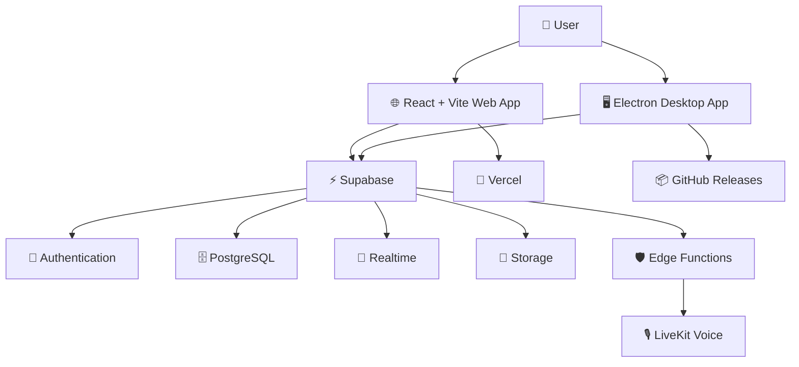

<div align="center">

# ⚡ FastlyNox

### One space. Every conversation. Zero distance.

**A modern communication platform built for communities, real-time conversations, and voice collaboration.**

[🌐 Live Demo](https://fastlynox.vercel.app) · [📦 Repository](https://github.com/Muffinsgram/FastlyNox) · [🐛 Report a Bug](https://github.com/Muffinsgram/FastlyNox/issues) · [✨ Request a Feature](https://github.com/Muffinsgram/FastlyNox/issues)

<br />

[](https://react.dev/)
[](https://vite.dev/)
[](https://supabase.com/)
[](https://livekit.io/)
[](https://www.electronjs.org/)

<br />

**💬 Real-time Messaging · 🎙️ Voice Rooms · 🌐 Web · 🖥️ Windows**

</div>

---

## 📖 Table of Contents

- [🌟 About](#-about)
- [✨ Features](#-features)
- [🛠️ Technology Stack](#️-technology-stack)
- [🏗️ Architecture](#️-architecture)
- [🚀 Getting Started](#-getting-started)
- [⚙️ Environment Variables](#️-environment-variables)
- [🗄️ Database Setup](#️-database-setup)
- [🌍 Deployment](#-deployment)
- [🖥️ Windows Desktop App](#️-windows-desktop-app)
- [🧪 Development & Testing](#-development--testing)
- [🔐 Security](#-security)
- [🤝 Contributing](#-contributing)
- [📄 License](#-license)

---

## 🌟 About

**FastlyNox** is a real-time communication application designed to bring people together through messaging, communities, and voice conversations.

Built with a modern React frontend and powered by Supabase and LiveKit, FastlyNox combines the flexibility of a web application with the convenience of a native Windows desktop experience.

Whether you're building a community, chatting with friends, organizing conversations into servers and channels, or joining a voice room, FastlyNox aims to keep communication connected in one place.

### 💡 The Vision

FastlyNox is built around three core principles:

- **⚡ Speed** — A responsive experience for everyday communication.
- **🔗 Connectivity** — Real-time messaging, presence, and voice interactions.
- **🧩 Flexibility** — A web application and a dedicated Windows desktop client.

> Communication should feel instant, communities should feel connected, and the tools we use should stay out of the way.

## ✨ Features

### 💬 Messaging & Conversations

- Real-time messaging powered by Supabase Realtime.
- Server-based communities with organized text channels.
- Direct messaging between users.
- Message editing and deletion.
- Message replies and reactions.
- Emoji selection and GIF discovery through GIPHY.
- Mention notifications and unread-message indicators.
- Attachment support with configurable expiration cleanup.

### 🌐 Communities & Servers

- Create and manage community servers.
- Organize conversations into channels.
- Server roles and permission management.
- Server ownership and administrative controls.
- Custom server invitations and public invitation previews.
- Public vanity URLs for supported servers.
- Member presence and real-time synchronization.
- Server announcements and unread server indicators.

### 👤 Profiles & Social Features

- Customizable profile pictures and banners.
- Profile biographies and banner positioning controls.
- User presence and activity indicators.
- One-way profile following.
- Media posts and 24-hour stories.
- In-app announcements and private reminders.
- Browser notification support for supported reminder workflows.

### 🎙️ Voice Communication

- LiveKit-powered voice rooms.
- Real-time voice participant presence.
- Voice-channel membership validation.
- Server-side voice token issuance.
- Voice participant moderation and channel movement.
- Reconnection support for voice sessions.
- Audio noise-suppression integrations.

Voice functionality depends on a correctly configured LiveKit deployment and the corresponding Supabase Edge Function.

### 🖥️ Windows Desktop Application

- Dedicated Electron desktop client.
- Windows x64 installer.
- Native desktop application packaging.
- Background release checks and update downloads.
- In-app update availability controls.
- GitHub Releases-based update distribution.

### 🔒 Security & Reliability

- Supabase authentication and database access controls.
- Row Level Security (RLS) policies.
- Server-side validation for sensitive voice operations.
- Role-based server permissions.
- Restricted administrative announcement publishing.
- Realtime synchronization and reconnect recovery.
- Configurable attachment retention and cleanup.

**Note:** Some features require the corresponding SQL migrations, storage policies, environment variables, or backend functions to be configured before they become available.

---

## 🛠️ Technology Stack

| Technology | Purpose |
| --- | --- |
| [React](https://react.dev/) | User interface |
| [Vite](https://vite.dev/) | Development server and production builds |
| [Tailwind CSS](https://tailwindcss.com/) | Utility-first styling |
| [Zustand](https://zustand.docs.pmnd.rs/) | Client-side state management |
| [Supabase](https://supabase.com/) | Authentication, PostgreSQL, storage, and realtime |
| [LiveKit](https://livekit.io/) | Voice communication infrastructure |
| [Electron](https://www.electronjs.org/) | Windows desktop application |
| [electron-updater](https://www.electron.build/auto-update) | Desktop release updates |
| [Lucide](https://lucide.dev/) | Interface icons |
| [GIPHY](https://developers.giphy.com/) | GIF search and discovery |
| [Vercel](https://vercel.com/) | Web deployment |
| [GitHub Actions](https://github.com/features/actions) | Automated desktop release workflow |

---

## 🏗️ Architecture

FastlyNox separates its client interface from the services responsible for authentication, persistence, and real-time communication.



### How it works

1. **Client layer:** React renders the application in the browser or inside Electron.
2. **Authentication and data:** Supabase provides user authentication, PostgreSQL, and storage.
3. **Realtime layer:** Supabase Realtime delivers supported messaging and presence updates.
4. **Voice layer:** LiveKit handles voice rooms, with Supabase Edge Functions issuing validated voice tokens.
5. **Deployment layer:** Vercel hosts the web application, while GitHub Releases distributes Windows desktop updates.

---

## 🚀 Getting Started

Follow these steps to run FastlyNox locally.

### Prerequisites

Make sure you have the following:

- [Node.js](https://nodejs.org/) — a version compatible with the dependencies in `package.json`.
- npm — included with Node.js.
- A configured [Supabase](https://supabase.com/) project.
- A configured [LiveKit](https://livekit.io/) deployment for voice features.
- A [GIPHY API key](https://developers.giphy.com/) if you want GIF search and discovery.

### 1. Clone the repository

```bash
git clone https://github.com/Muffinsgram/FastlyNox.git
cd FastlyNox
```

### 2. Install dependencies

```bash
npm install
```

### 3. Configure environment variables

Create a local environment file from the example:

**Windows — Command Prompt**

```bat
copy .env.example .env
```

**macOS / Linux**

```bash
cp .env.example .env
```

Open `.env` and provide the appropriate credentials for your services.

See [Environment Variables](#️-environment-variables) for details.

### 4. Configure Supabase

Create a Supabase project, then apply the required SQL migrations in the order described in [Database Setup](#️-database-setup).

Make sure your database schema, RLS policies, storage configuration, and required Edge Functions are in place.

### 5. Start the development server

```bash
npm run dev
```

Vite will display the local development URL in your terminal, typically:

`http://localhost:5173`

### 6. Run the Windows desktop client

Keep the Vite development server running and open a second terminal:

```bash
npm run desktop:dev
```

This starts the Electron application against the local development environment.

---

## ⚙️ Environment Variables

FastlyNox uses environment variables to configure its external services.

| Variable | Required | Description |
| --- | --- | --- |
| `VITE_SUPABASE_URL` | Yes | Supabase project URL |
| `VITE_SUPABASE_ANON_KEY` | Yes | Supabase publishable/anonymous client key |
| `VITE_PUBLIC_APP_URL` | Yes for deployment | Canonical public HTTPS application URL |
| `VITE_LIVEKIT_URL` | For voice | LiveKit WebSocket URL |
| `VITE_LIVEKIT_API_KEY` | For voice | LiveKit API key |
| `LIVEKIT_API_SECRET` | Server-side only | LiveKit API secret |
| `VITE_GIPHY_API_KEY` | Optional | GIPHY client API key |

Example:

```dotenv
VITE_SUPABASE_URL=https://your-project.supabase.co
VITE_SUPABASE_ANON_KEY=your-supabase-anon-key

VITE_PUBLIC_APP_URL=https://fastlynox.vercel.app

VITE_LIVEKIT_URL=wss://your-livekit-host
VITE_LIVEKIT_API_KEY=your-livekit-api-key
LIVEKIT_API_SECRET=your-livekit-api-secret

VITE_GIPHY_API_KEY=your-giphy-api-key
```

### ⚠️ Important security rules

- Never commit your `.env` file.
- Never expose `LIVEKIT_API_SECRET` to browser code.
- Never rename the server-side secret to `VITE_LIVEKIT_API_SECRET`.
- Never put Supabase service-role credentials in the client or Vercel client-side environment.
- Use only the Supabase client key intended for browser access, with appropriate RLS policies.
- Keep production secrets in the appropriate server-side environment.

Environment variables prefixed with `VITE_` are exposed to client-side application code. Treat them as public values.

---

## 🗄️ Database Setup

FastlyNox relies on Supabase SQL migrations for database structure, access policies, and additional application features.

Run the SQL files using the Supabase SQL Editor.

### Core setup

Apply the required baseline schema and security policies first. The repository includes the following scripts for core functionality and subsequent features:

1. `rls-security-policies.sql`
2. `migration_server_creation.sql`
3. `migration_edit_delete.sql`
4. `migration_message_reactions.sql`
5. `migration_message_replies.sql`
6. `migration_profile_customization.sql`
7. `migration_channel_order.sql`
8. `migration_global_announcements.sql`
9. `migration_chat_mentions_notifications.sql`

### Realtime, presence & social synchronization

After the baseline schema is available, apply:

- `migration_friendships_realtime.sql`
- `migration_user_presence.sql`
- `migration_realtime_sync_reliability.sql`

The realtime reliability migration includes synchronization settings, presence sessions, and direct-message unread notification support. Resolve duplicate legacy friendship pairs before rerunning it if the uniqueness constraint cannot be created.

### Additional migrations

Other migrations cover features such as:

- Voice presence and moderation.
- Server roles and permissions.
- Invitation previews and public identifiers.
- Message reactions and notification read states.
- Profile customization and social activity.
- Story storage and attachment expiration.
- Server operations and administration.

Review the individual SQL files before applying additional migrations, and use the repository's current schema as the source of truth.

### Voice token function

Deploy the voice-token Edge Function:

```bash
supabase functions deploy livekit-token
```

Configure the following Edge Function secrets:

```bash
supabase secrets set LIVEKIT_API_KEY=your-livekit-api-key
supabase secrets set LIVEKIT_API_SECRET=your-livekit-api-secret
```

The function validates the authenticated session and voice-channel membership before issuing a time-limited token.

### Attachment cleanup

For scheduled deletion of expired attachments:

1. Deploy `cleanup-expired-attachments`.
2. Configure `ATTACHMENT_CLEANUP_SECRET` as an Edge Function secret.
3. Store the cleanup configuration in Supabase Vault.
4. Apply `migration_attachment_expiry.sql` to schedule the cleanup job.

The cleanup process requires a configured Supabase project; running the frontend alone does not provide scheduled background deletion.

---

## 🌍 Deployment

### Deploy the web application to Vercel

1. Import [Muffinsgram/FastlyNox](https://github.com/Muffinsgram/FastlyNox) into Vercel.
2. Select the Vite framework preset.
3. Set the build command to `npm run build`.
4. Set the output directory to `dist`.
5. Configure the required environment variables for Production, Preview, and Development.
6. Set `VITE_PUBLIC_APP_URL` to the canonical HTTPS domain.
7. Apply the public invitation preview migration before deploying the related functionality.

**Build settings**

| Setting | Value |
| --- | --- |
| Framework | Vite |
| Build command | `npm run build` |
| Output directory | `dist` |
| Install command | `npm install` |

The live web application is available at:

**[https://fastlynox.vercel.app](https://fastlynox.vercel.app)**

If you use a custom domain, update `VITE_PUBLIC_APP_URL` accordingly.

### Public invitation previews

FastlyNox includes support for server-rendered invitation preview metadata, Open Graph information, and public server sitemap entries.

Public vanity links can be indexed when the relevant deployment and domain verification requirements are satisfied. Short-lived, limited-use, or otherwise restricted invitations are marked `noindex`.

Search engine indexing is not guaranteed and may take time.

---

## 🖥️ Windows Desktop App

FastlyNox includes a Windows desktop client built with Electron.

### Build locally

Start the Vite development server:

```bash
npm run dev
```

In a separate terminal, run:

```bash
npm run desktop:dev
```

### Create a Windows installer

```bash
npm run dist:win
```

The Windows build targets **x64** and creates an NSIS installer. The build script writes the installer to:

```text
%LOCALAPPDATA%\Fastlynox\windows-build\
```

This location helps avoid file-renaming restrictions in protected project directories.

### Automatic updates

The desktop client checks the public GitHub Releases page for new versions. When an update is available, it downloads in the background and presents an update control in the title bar.

Updates can be installed by restarting through the update control or by closing and reopening the application.

### Publish a release

Configure these GitHub Actions repository secrets:

- `VITE_SUPABASE_URL`
- `VITE_SUPABASE_ANON_KEY`
- `VITE_PUBLIC_APP_URL`
- `VITE_LIVEKIT_URL`
- `VITE_LIVEKIT_API_KEY`

`VITE_GIPHY_API_KEY` is optional.

Then push a semantic-version tag, for example:

```bash
git tag v1.0.1
git push origin v1.0.1
```

The release workflow builds the Windows installer and publishes the installer and updater metadata to GitHub Releases.

**Important:** Keep the generated `latest.yml`, `.exe`, and `.blockmap` release assets available. Do not place `LIVEKIT_API_SECRET` in the desktop build secrets.

Windows may display a SmartScreen warning because the installer is not code-signed. A code-signing certificate can improve publisher trust.

---

## 🧪 Development & Testing

FastlyNox includes scripts for linting, automated tests, and production builds.

### Available commands

| Command | Description |
| --- | --- |
| `npm run dev` | Start the Vite development server |
| `npm run desktop:dev` | Launch the Electron desktop client |
| `npm run build` | Build the production web application |
| `npm run preview` | Preview the production build locally |
| `npm run lint` | Run Oxlint |
| `npm test` | Run the Node.js test suite |
| `npm run dist:win` | Build the Windows installer |
| `npm run release:win` | Run the Windows release build script |

### Run the checks

```bash
npm run lint
npm test
npm run build
```

For changes involving authentication, database access, storage, or voice communication, also verify the corresponding Supabase policies, migrations, and Edge Functions.

Live integration tests require a correctly configured Supabase project and any relevant external services.

---

## 🔐 Security

Security is an essential part of any real-time communication platform.

When deploying or contributing to FastlyNox:

- Apply and review Row Level Security policies.
- Validate authorization on the server side.
- Keep privileged API secrets out of the browser.
- Restrict server-management actions to authorized roles.
- Protect storage access and user-owned media.
- Configure cleanup jobs for expiring attachments.
- Never commit production credentials or private keys.
- Review migration changes before applying them to production.
- Keep dependencies updated and investigate security advisories.

If you discover a security vulnerability, please avoid publishing sensitive exploit details in a public issue. Contact the repository maintainer privately to coordinate a responsible disclosure.

---

## 🤝 Contributing

Contributions, bug reports, and ideas are welcome!

### Contribution workflow

1. Fork the repository.
2. Create a feature branch.
3. Make your changes.
4. Run linting, tests, and the production build.
5. Commit your changes with a clear message.
6. Open a pull request describing the changes.

Example:

```bash
git checkout -b feature/your-feature
npm install

npm run lint
npm test
npm run build

git add .
git commit -m "feat: add your feature"
git push origin feature/your-feature
```

Please keep pull requests focused, document any required environment variables or migrations, and avoid committing generated artifacts or secrets.

For bugs and feature requests, visit the [GitHub Issues](https://github.com/Muffinsgram/FastlyNox/issues) page.

---

## 🗺️ Roadmap

FastlyNox is an evolving project. Potential areas for future development include:

- [ ] Expanded automated integration testing.
- [ ] Improved onboarding and setup documentation.
- [ ] Additional accessibility and usability improvements.
- [ ] Further realtime reliability improvements.
- [ ] Expanded community and moderation tooling.
- [ ] More comprehensive deployment and operational guides.

Roadmap items are suggestions rather than promises or confirmed release dates.

---

## 📄 License

FastlyNox includes a `LICENSE` file in the repository.

Please review the [project license](https://github.com/Muffinsgram/FastlyNox/blob/main/LICENSE) before redistributing or modifying the project.

---

<div align="center">

### ⚡ Built for conversations. Designed for communities.

**FastlyNox — Stay connected.**

[🌐 Website](https://fastlynox.vercel.app) · [⭐ Star on GitHub](https://github.com/Muffinsgram/FastlyNox) · [💬 Join the development](https://github.com/Muffinsgram/FastlyNox/issues)

<sub>Made with ❤️ by <a href="https://github.com/Muffinsgram">Muffinsgram</a></sub>

</div>
